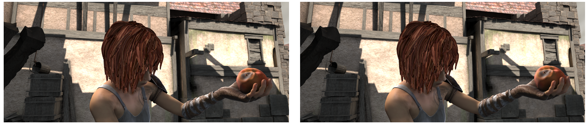
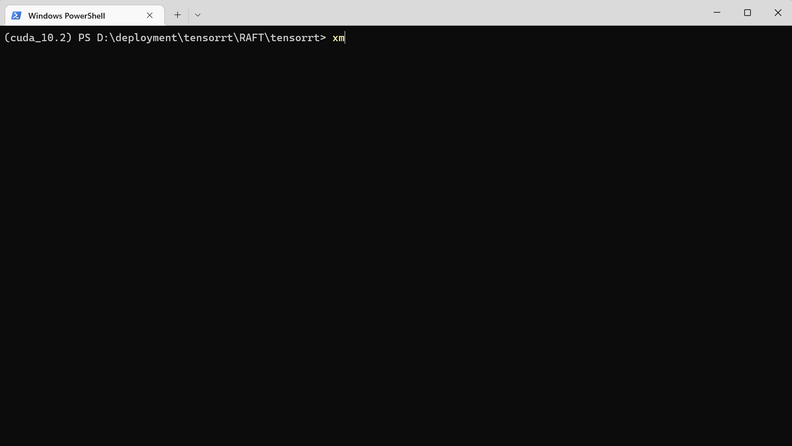

# RAFT

**TensorRT** and C++ deployment for **ECCV 2020 best paper** 《*RAFT: Recurrent All Pairs Field Transforms for Optical Flow*》。

[paper](https://arxiv.org/pdf/2003.12039.pdf)    [github](https://github.com/princeton-vl/RAFT)   [知乎]()




# 环境（Environment）

1. Pytorch                1.10.2
2. **CUDA**                   10.2
3. cuDNN                 8.4.1
4. Numpy                1.21.6
5. onnx                    1.12.0
6. onnx-simplifier  0.4.9
7. onnxRuntime     1.13.1
8. **TensorRT**             8.5.1.7
9. Polygraphy          0.43.1
10. **Microsoft Visual Studio 2019**
11. C++17
12. **OpenCV**               [4.5.3](https://opencv.org/releases/)

# Pytorch → ONNX

对源码进行若干修改，得到 [pytorch code](https://github.com/hermosayhl/RAFT_TensorRT/tree/main/pytorch)，首先进入 pytorch 目录，导出 onnx

```shell
python export.py
```

得到 RAFT.onnx，做简化

```shell
python -m onnxsim ../onnxruntime/RAFT.onnx ../onnxruntime/RAFT_simplified.onnx
```

自 onnxsim-0.4.0 之后，onnxsim 不再需要指定 --dynamic-input-shape，见 [issue](https://github.com/daquexian/onnx-simplifier/issues/189)。

执行上面两步，在 [onnxruntime](https://github.com/hermosayhl/RAFT_TensorRT/tree/main/onnxruntime) 目录下即可看到 RAFT.onnx、RAFT_simplified.onnx，借助 [Netron](https://netron.app/) 可视化，


目前支持动态输入，但输入的高宽必须是 8 的倍数，这是 RAFT 本身网络结构限制的。

# ONNXRuntime

进入[onnxruntime](https://github.com/hermosayhl/RAFT_TensorRT/tree/main/onnxruntime) 目录，运行

```shell
python inference.py
```

默认使用 CPU 推理，结果如下：


onnx 模型和 pytorch 模型是否精度对齐？暂未验证。

需要注意的一点是，上一步导出 onnx 使用的是 trace 模式，所以 RAFT 中的迭代次数是固定的默认值，暂时没有很优雅的传递 Python 标量的手段，能设置迭代次数。

# ONNX → TensorRT

进入 [pytorch code](https://github.com/hermosayhl/RAFT_TensorRT/tree/main/pytorch) 目录，通常可以使用 trtexec 将 onnx 转成 TensorRT 引擎，同时评测速度

```shell
trtexec --onnx=../onnxruntime/RAFT_simplified.onnx \
        --verbose \
        --minShapes=image1:1x3x256x256,image2:1x3x256x256 \
        --optShapes=image1:1x3x440x1024,image2:1x3x440x1024 \
        --maxShapes=image1:1x3x768x1024,image2:1x3x768x1024 \
        --saveEngine=../tensorrt/engine/RAFT.plan
```

目前只测了 float32 的速度，比较慢，后续可能需要热点分析、自定义算子来优化。


也可以使用 Polygraphy 工具得到 TensorRT 工具，同时比较 onnxruntime，检验精度是否对齐

```shell
polygraphy run ../onnxruntime/RAFT_simplified.onnx \
	--onnxrt --trt \
	--workspace 1000000000 \
	--save-engine=../tensorrt/engine/RAFT2.plan \
	--atol 0.1 \
	--verbose \
	--trt-min-shapes 'image1:[1,3,256,256]' 'image2:[1,3,256,256]' \
	--trt-opt-shapes 'image1:[1,3,440,1024]' 'image2:[1,3,440,1024]' \
	--trt-max-shapes 'image1:[1,3,768,1024]' 'image2:[1,3,768,1024]' \
	--input-shapes 'image1:[1,3,440,1024]' 'image2:[1,3,440,1024]' \
	--val-range 'image1:[0,255]' 'image2:[0,255]'
```

用法和 trtexec 很类似，但支持动态 shape 时的写法很不一样，上面两种写法是可以的，对输出测试精度是否对齐，可以看出，对的不是很齐，个人猜测是迭代次数太多导致的。


绝对误差


相对误差


同时 polygraphy 也可以用于简化 onnx 模型，性质类似于 onnx-simplifier，输入以下命令

```shell
polygraphy surgeon sanitize ../onnxruntime/RAFT_simplified.onnx ../onnxruntime/RAFT_sanitized.onnx --fold-constants
```

和 onnx-simplifier 相比，polygraphy 速度更快，且不需要推理也可能简化；onnx-simplifier 依赖 onnxruntime 的推理，而且 polygraphy 有时候可以做的更彻底，如下图中输出的第 2 个通道


# TensorRT

## CMake Configuration

进入[tensorrt](https://github.com/hermosayhl/RAFT_TensorRT/tree/main/tensorrt) 目录，建立 build 目录

```shell
mkdir build
cd build
cmake ..
```

如果 cmake 发生错误，可以进入 [cmake](https://github.com/hermosayhl/RAFT_TensorRT/tree/main/tensorrt/cmake) 目录修改 CUDA、OpenCV、TensorRT 路径，重新 cmake ..。

在 build 下点击生成的 **RAFT_TRT.sln**，用 Visual Studio 2019 打开，解决方案→ raft estimator→ CMakeLists.txt→项目→设为启动项目，最后 **生成→生成解决方案**。


## XMake Configuration

```bash
xmake
xmake build
xmake run
```



## Ubuntu

Ubuntu 在 ~/.bashrc 中添加如下内容，做个记录

```bash
# OpenCV
export PKG_CONFIG_PATH=/home/dx/usrs/liuchang/tools/opencv/build/install/lib/cmake/opencv4:$PKG_CONFIG_PATH
export LD_LIBRARY_PATH=/home/dx/usrs/liuchang/tools/opencv/build/install/lib:$LD_LIBRARY_PATH
export OpenCV_DIR=/home/dx/usrs/liuchang/tools/opencv/build/install
# TensorRT
export TRT_ROOT=/home/dx/usrs/liuchang/tools/TensorRT-8.5.3.1
export PATH=$TRT_ROOT/targets/x86_64-linux-gnu/bin:$PATH
export LD_LIBRARY_PATH=$TRT_ROOT/targets/x86_64-linux-gnu/lib:$LD_LIBRARY_PATH
```

# 参考

> ```tex
> @inproceedings{teed2020raft,
> title={Raft: Recurrent all-pairs field transforms for optical flow},
> author={Teed, Zachary and Deng, Jia},
> booktitle={European conference on computer vision},
> pages={402--419},
> year={2020},
> organization={Springer}
> }
> @inproceedings{butler2012naturalistic,
>   title={A naturalistic open source movie for optical flow evaluation},
>   author={Butler, Daniel J and Wulff, Jonas and Stanley, Garrett B and Black, Michael J},
>   booktitle={European conference on computer vision},
>   pages={611--625},
>   year={2012},
>   organization={Springer}
> }
> ```